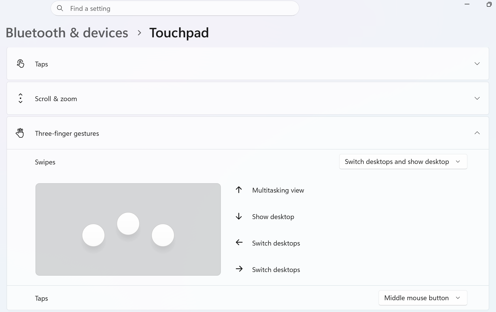

# windows

## install winget
```
https://github.com/microsoft/winget-cli
```

## apps

```
winget install -e --id Microsoft.WindowsTerminal
winget install Rufus.Rufus
winget install uutils.coreutils
winget install Alacritty.Alacritty
winget install shinchiro.mpv
winget install Microsoft.VisualStudioCode
winget install Python.Python.3.14
winget install Microsoft.OpenJDK.21
winget install Git.Git
winget install TortoiseSVN.TortoiseSVN
winget install TortoiseGit.TortoiseGit
winget install Joplin.Joplin
winget install Discord.Discord
winget install Mozilla.Firefox
winget install Google.Chrome
winget install Microsoft.Teams
winget install Zoom.Zoom
winget install Tencent.WeChat
winget install sakura-editor.sakura
winget install 7zip.7zip
winget install Microsoft.PowerToys
winget install voidtools.Everything
winget install VideoLAN.VLC
winget install GIMP.GIMP
winget install -e --id DBeaver.DBeaver.Community
winget install -e --id DupeGuru.DupeGuru
winget install WinMerge.WinMerge
winget install Telerik.Fiddler.Classic 
winget install -e --id Atlassian.Sourcetree
winget install Nextcloud.NextcloudDesktop

winget install 2dust.v2rayN
winget install -e --id WireGuard.WireGuard
winget install -e --id CrystalDewWorld.CrystalDiskMark
winget install -e --id CPUID.CPU-Z

winget install KDE.KDEConnect
winget install -e --id CrystalDewWorld.CrystalDiskInfo
winget install -e --id Valve.Steam

# winget install -e --id Kingsoft.WPSOffice

wsl --install
winget install Docker.DockerDesktop
```

## config
```
https://github.com/Raphire/Win11Debloat
https://github.com/Prathewsh/Windows10Debloater

winget upgrade --all

[Environment]::SetEnvironmentVariable("Path", $env:Path + ";C:\Program Files\MPV Player", "User")
# [Environment]::SetEnvironmentVariable("Path", $env:Path + ";$env:LOCALAPPDATA\Programs\mpv", "User")

# execution policy for python
Set-ExecutionPolicy -ExecutionPolicy RemoteSigned -Scope CurrentUser

# Make Windows Use UTC
reg add "HKEY_LOCAL_MACHINE\SYSTEM\CurrentControlSet\Control\TimeZoneInformation" /v RealTimeIsUniversal /t REG_DWORD /d 1 /f

rm ~/.ssh/config
```

## 日本語入力切り替え
```
alt + `
shift + capslk
```
## touchpad

